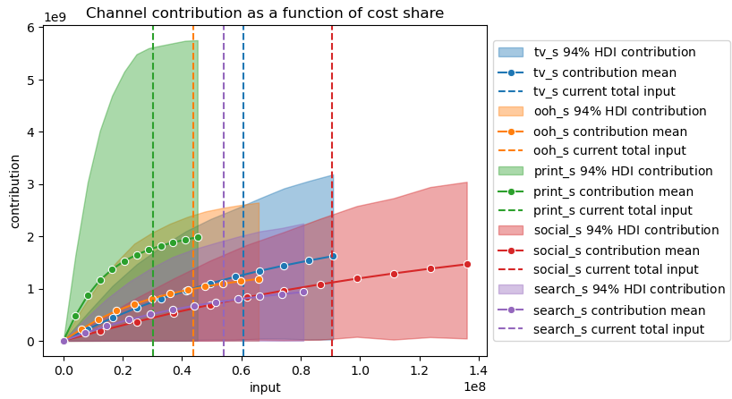
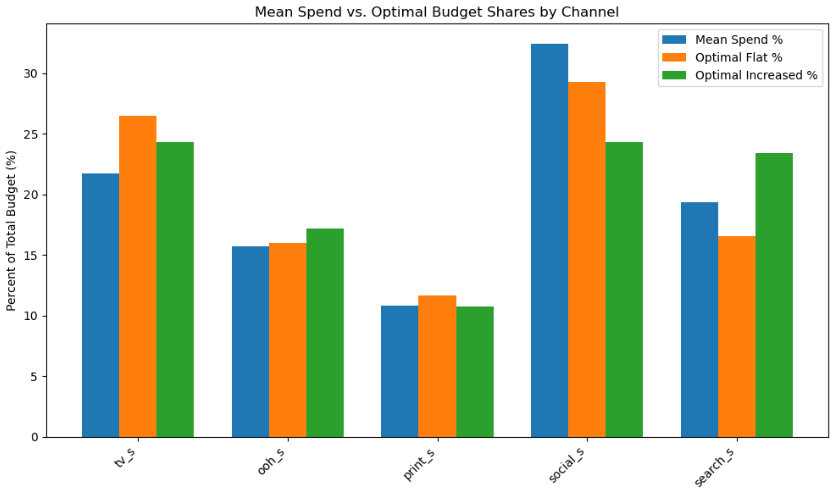
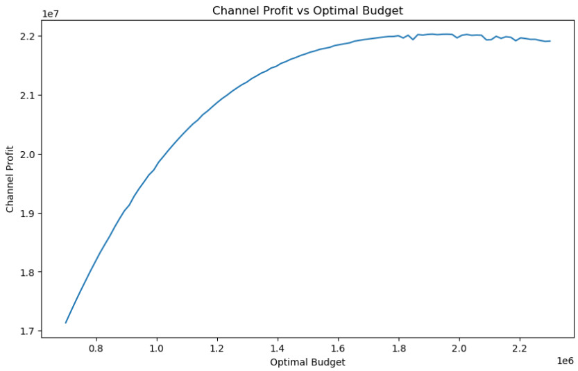

# Marketing Mix Modeling (MMM) with PyMC-Marketing

## Project Background

This project assists a US-based e-commerce retailer in understanding how each marketing channel within their current mix drives incremental revenue. The model applies PyMC-Marketing’s Bayesian MMM framework with adstock and saturation transformations. By quantifying channel-level contributions to revenue through MCMC sampling, the project enables data-driven budget allocation decisions to maximize their return on advertising spend (ROAS).

The dataset includes daily spend and sales records for television, out-of-home (OOH), print, social media, and search channels over a 328-day period. By utilizing adstock carry-over modeling, Hill-function saturation effects, and Bayesian inference, this project aims to:

-	Quantify channel-specific ROAS and elasticities to identify the highest-impact marketing investments.
-	Forecast incremental revenue lift under an optimized budget allocation scenario.
-	Model carry-over effects to optimize campaign timing and pacing.
  
These insights guide strategic reallocation of marketing budgets to maximize overall profit. Channel elasticity distributions, optimal spend recommendations, and posterior diagnostic metrics are detailed below. [Recommendations](https://github.com/hallie-marshall/ecommerce-mmm/edit/main/README.md#recommendations) are provided for next steps. These include incorporating regional adjustments, building segment-specific allocations, and integrating offline promotional activities.

## Data Structure

The main table used for this project consists of 328 daily records, including the following columns:

**Date:** Calendar date of observation

**Revenue:** Total daily revenue (USD)

**TV_S:** Daily TV advertising spend (USD)

**OOH_S:** Daily Out-Of-Home (billboards, transportation, etc.) advertising spend (USD)

**Print_S:** Daily print advertising spend (USD)

**Social_S:** Daily advertising spend on social media placements (USD)

**Social_I:** Daily social media impressions

**Search_S:** Daily search advertising spend (USD)

**Search_Clicks_P:** Daily counts of clicks generated by search advertising

**Competitor_Sales_B:** Daily sales volume benchmark (USD) for competitor’s brand, included as an external control variable

Additional time control features were created; including **trend, year, month,** and **dayofyear.**

## Executive Summary

The project quantifies the revenue contribution of the five marketing channels using Bayesian Delayed-Saturation MMM. By optimizing the proportional spend of each channel with the current budget remaining flat, the proportions change as follows.

Median posterior beta coefficients, elasticities, represent the percent revenue change per 1% spend change. With 95% confidence, **median elasticity per channel ranges from 0.106 (Search) to 0.209 (TV)**, confirming relative responsiveness.

Optimization by channel results in **mean ROAS estimates ranging from 12.32 (Social) to 58.61 (Print)**.

By reallocating the existing total budget of $930,977 between the existing five channels, estimated **profits increase by $592,764 (+3.1%)**. 

To maximize profit returns on marketing spend, total budgets should **increase by $1,912,121**. This increased allocation results in an **incremental $2,395,435 (+12.4% vs. “flat” budget) profit** for a total projected profit of $21,718,559.

## Insights

 

_This plot shows, for each marketing channel, how incremental revenue (contribution) grows as a function of its share of total budget. Solid lines mark the mean contribution curve, shaded areas represent the 94% highest-density interval, and vertical dashed lines indicate each channel’s current budget share._

The project quantifies the revenue contribution of the five marketing channels using Bayesian Delayed-Saturation MMM. Optimized proportional spend of each channel with the current budget remaining flat, as well as budgets optimized for maximum profit, are listed below.

*Channel: Original &rarr; Optimized Flat &rarr; Optimized Maximum*

Social: 32.5% &rarr; 29.3% &rarr; 24.3%

TV: 21.7% &rarr; 26.5% &rarr;  24.3%

Search: 19.3% &rarr; 16.5% &rarr; 23.4%

OOH: 15.7% &rarr; 16.0% &rarr; 17.1%

Print: 10.8% &rarr; 11.7% &rarr; 10.8%

**Median elasticities per channel**, with 95% confidence intervals, are as follows.

Social: 0.183 ( 0.004 – 0.454 )

TV: 0.209 ( 0.003 – 0.588 )

Search: 0.106 ( 0.000 – 0.292 )

OOH: 0.109 ( 0.000 – 0.291 )

Print: 0.159 ( 0.000 – 0.476 )

This mix update results in the following **ROAS rankings by channel** (mean, 95% confidence interval range).

Social: 12.32 ( 1.41 – 32.47 )

TV: 20.83  ( 2.53 – 57.38 )

Search: 14.03  ( 0.40 – 49.86 )

OOH: 22.68  ( 0.88 – 86.34 )

Print: 58.61  ( 1.35 – 280.32 )

_This curve traces aggregate channel profit (contribution minus budget) as the overall marketing budget increases. Profit rises steeply at first, peaks at about $1.9 Million, and then plateaus._

By optimizing the total budget based on channel profit, profits are maximized. Increasing the total budget to $1,912,121 produces an estimated additional profit of $2,395,435, resulting in an estimated total profit of $21,718,559. The **dollar proportions of budget per channel**, with updated ROAS, for an increased budget are:

Social: $465,488 (est. ROAS: 10.11)

TV: $465,488 (est. ROAS: 11.89)

Search: $447,170 (est. ROAS: 6.94)

OOH: $327,923 (est. ROAS: 11.89)

Print: $206,051 (est. ROAS: 30.59)

## Recommendations

There are several opportunities to further utilize these insights, optimize strategies and enhance marketing capabilities. A few of these may include:

-	Fine-tune regional or 360-degree campaigns based on local market media costs and seasonality.
  
-	Build customer segment-specific MMMs for high value customer cohorts or product categories to find differentiated responses, tailoring spend accordingly.
  
- Integrate offline promotional activities by adding event dummies for in-store sales, pop-up events, and traditional promotions.
  
-	Develop an interactive dashboard that allows adjustments by stakeholders, showing the profit and ROAS impact through budget and channel proportion modification.

These recommendations ensure continuous improvement and translate model insights into actionable budgetary decisions.

## Assumptions and Caveats

-	Data was only used for US-based customers. Including foreign customer data may lead to differing results.
  
-	The dataset consists of 328 entries for daily spend, engagement and competitor benchmarks. Trends observed in this timeframe may not fully account for external factors beyond this window.
  
-	Models do not account for external influences such as economic trends, competitor activity, or shifts in purchasing behavior.

-	Adstock and saturation parameters assume consistent channel response patterns over time; significant creative or channel strategy changes may invalidate past estimates.
  
-	No holdout validation was performed. Future assessments should include out-of-sample testing to confirm forecast accuracy.

